# ZMK Configuration for Corne with Miryoku

[](https://github.com/re1983/zmk-for-keyboards/actions/workflows/build.yml)
[](https://github.com/re1983/zmk-for-keyboards/actions/workflows/generate-keymaps.yml)
[](https://caksoylar.github.io/keymap-drawer)

My ZMK configuration for Corne keyboard with Miryoku layout.

## Keymap Visualization

### Corne Keymap (Default Layout)

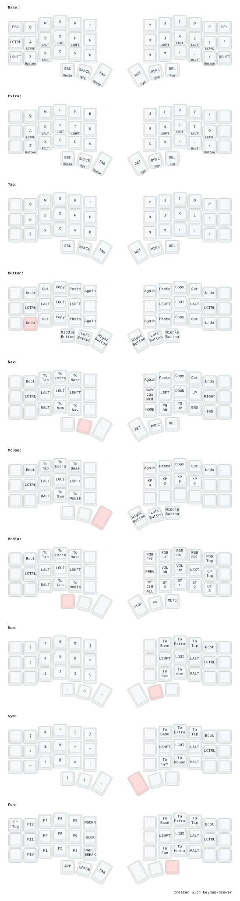

### Compact Layouts

<details>
<summary>1-Column Layout (Click to expand)</summary>

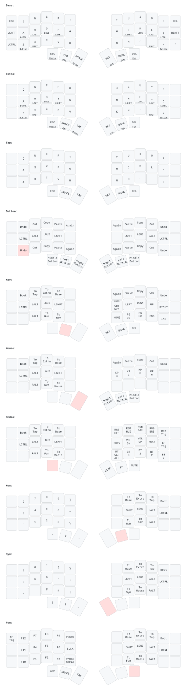

</details>

<details>
<summary>2-Column Layout (Click to expand)</summary>

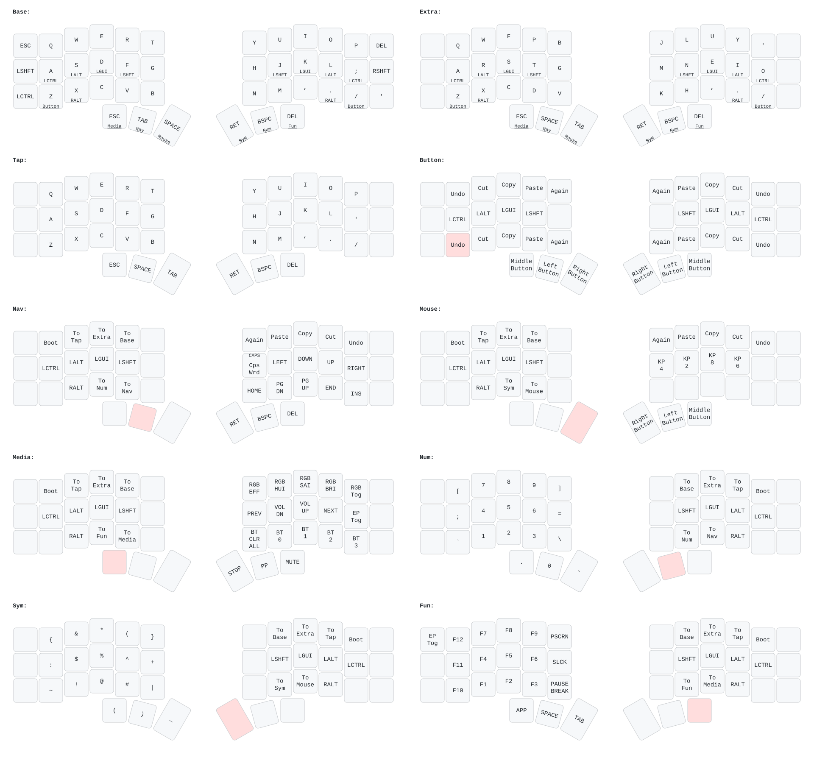

</details>

<details>
<summary>3-Column Layout (Click to expand)</summary>

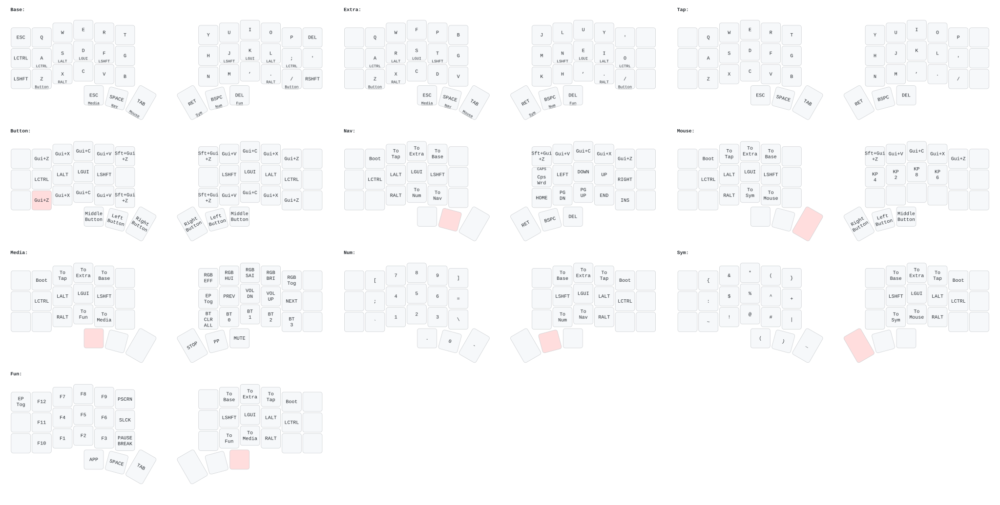

</details>

<details>
<summary>Dark Theme (Click to expand)</summary>

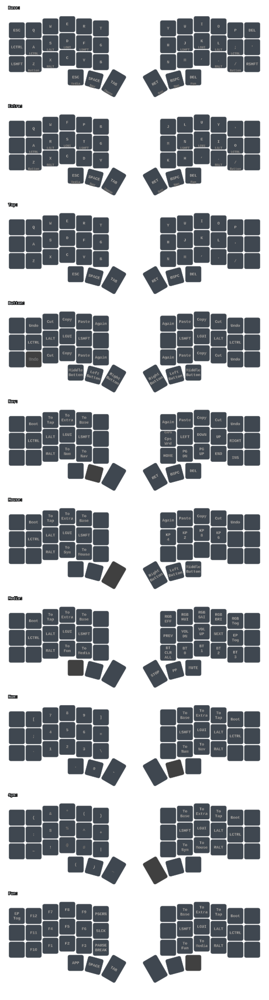

</details>

<details>
<summary>Individual Layers (Click to expand)</summary>

*Each layer shown individually - keys only, no combos*

| Layer | Diagram |
|-------|---------|
| Base | 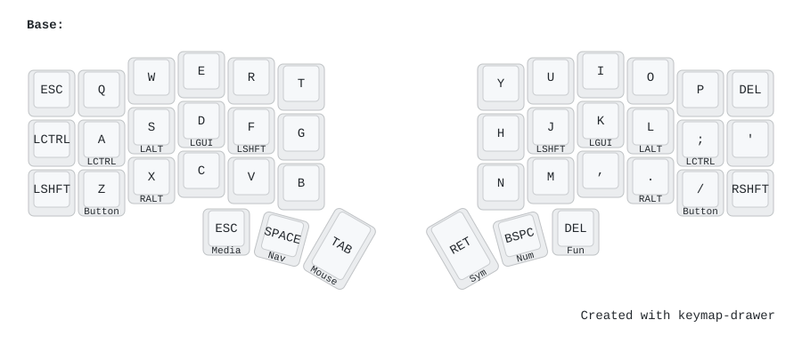 |
| Extra | 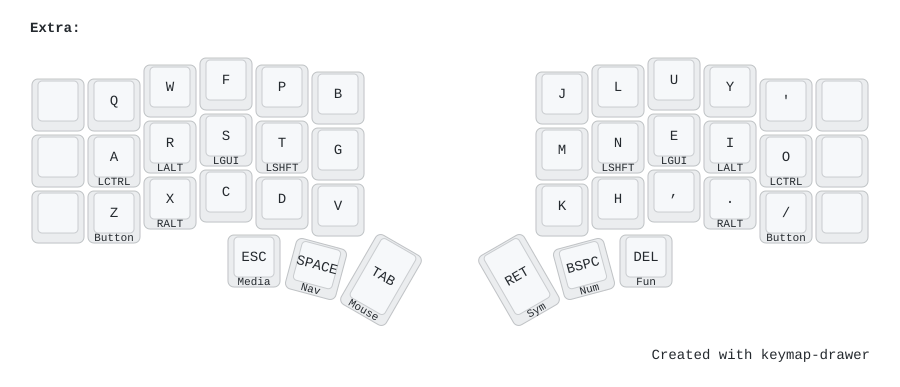 |
| Navigation | 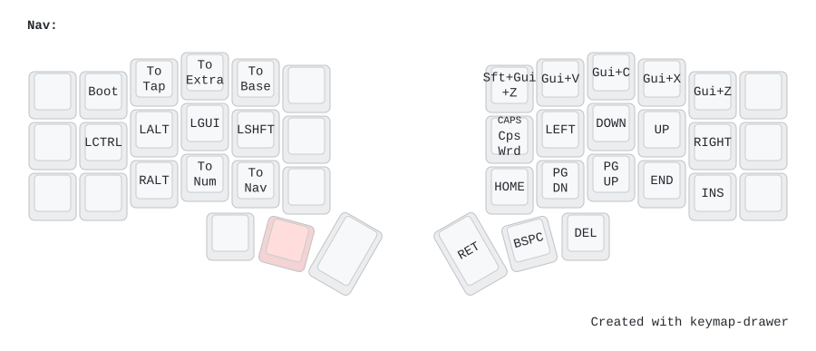 |
| Numbers | 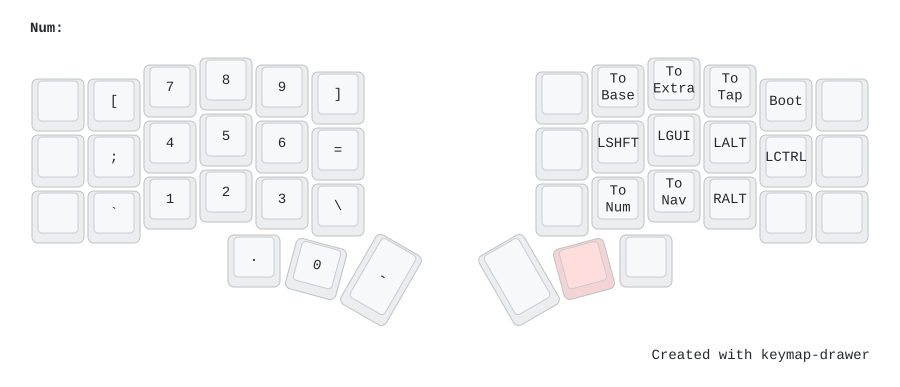 |
| Symbols | 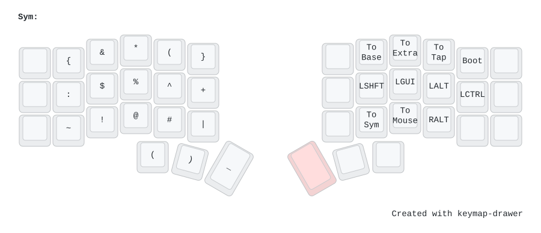 |
| Function | 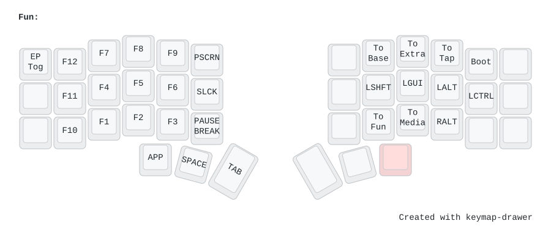 |
| Mouse | 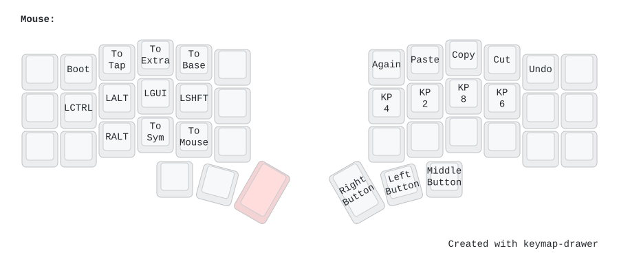 |
| Media | 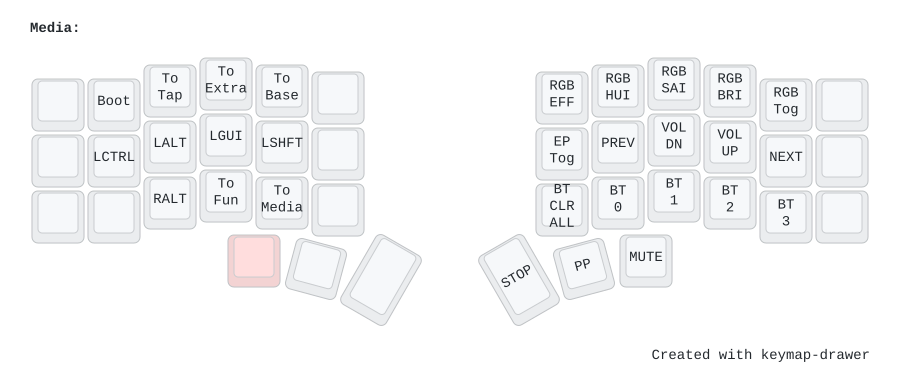 |
| Button | 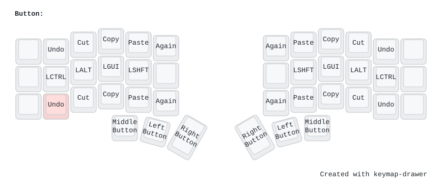 |
| Tap | 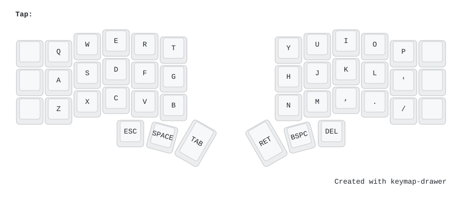 |

</details>

<details>
<summary>Combo Keys (Click to expand)</summary>


*Dedicated visualization showing all combo key combinations using keymap-drawer/raw_configuration.yaml style*

</details>

*Automatically generated by [keymap-drawer](https://github.com/caksoylar/keymap-drawer)*

## Features

- ✨ Uses [Miryoku](https://github.com/manna-harbour/miryoku) layout
- 🔄 Bluetooth pairing and clearing functionality
- 🌈 RGB underglow effects support
- 📱 Nice!View display support
- 🎨 Automatic keymap diagram generation

## Configuration Guide

### Bluetooth Pairing Clear

To clear bluetooth pairing:
1. Hold **ESC** to enter MEDIA layer
2. Hold **Shift** (F or J key) + **BT0** simultaneously

### RGB Effects

- Default effect: Rainbow (effect #3)
- Switch between different effects using dedicated keys

## Project Structure

```
├── config/
│   ├── corne.conf          # Main configuration file
│   ├── corne.keymap        # Keymap definition (references Miryoku)
│   └── miryoku/            # Miryoku layout files
├── keymap-drawer/          # Auto-generated layout diagrams
└── .github/workflows/      # GitHub Actions workflows
```

## Setup Instructions

1. Fork this repository
2. Enable workflows in GitHub Actions page
3. Modify files under `config/` to customize your configuration
4. Push changes - GitHub Actions will automatically compile firmware and generate diagrams

## Resources

- [ZMK Firmware](https://zmk.dev/)
- [Miryoku Layout](https://github.com/manna-harbour/miryoku)
- [keymap-drawer](https://github.com/caksoylar/keymap-drawer)
- [Corne Keyboard](https://github.com/foostan/crkbd)
